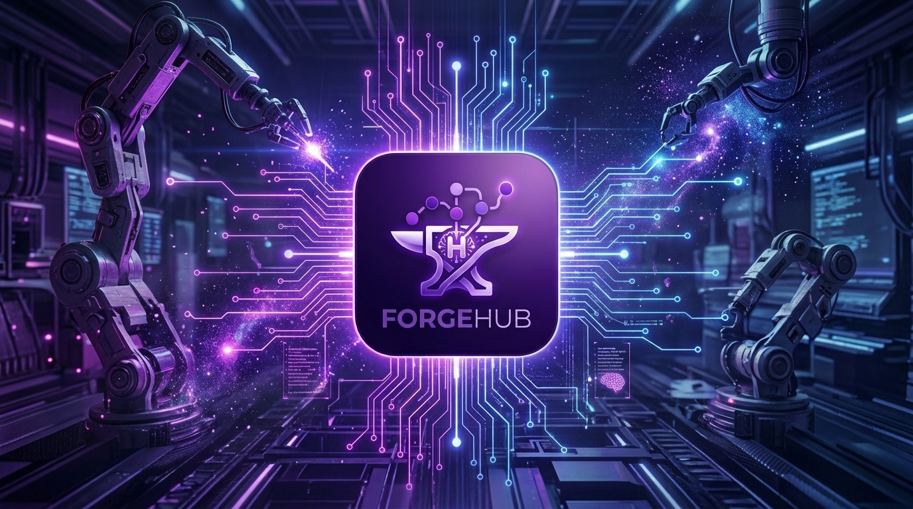

# ForgeHub



A frontend for orchestrating ComfyUI workflows — against a local ComfyUI instance or a Runpod Serverless endpoint. Python FastAPI backend + React/TypeScript frontend (web or Electron).

Companion to the workers: [runpod-qwen21](https://github.com/huchukato/runpod-qwen21) (Qwen Image 2.1 T2I/Edit + Pony) · [runpod-minimax-h3](https://github.com/huchukato/runpod-minimax-h3) (MiniMax H3 video+audio)

## Quick start

**macOS / Linux**

```bash
git clone https://github.com/huchukato/ForgeHub.git && cd ForgeHub
./start.sh
```

**Windows**

```bat
git clone https://github.com/huchukato/ForgeHub.git && cd ForgeHub
start.bat
```

The script handles everything: installs **uv** if missing, creates `.venv` and installs the backend (`pip install -e .`), runs `npm install` + frontend build, then starts on **http://127.0.0.1:8484**. On first run it copies `.env.example` → `.env`: fill it in (Runpod API key + endpoint id) and relaunch.

Options: `./start.sh --build` forces a frontend rebuild · `./start.sh --dev` starts backend + Vite dev server (:5173, hot reload).

Prerequisites: only **Node.js** (for the frontend build) — everything else is handled by uv.

## Execution modes

| `FORGEHUB_EXECUTION_MODE` | What it does |
| --- | --- |
| `serverless` | Job → `api.runpod.ai/v2/{endpoint}/run`, base64 output → `data/storage`, served from `/outputs/` |
| `direct` | Job → local ComfyUI (`COMFYUI_HOST:PORT`, default `localhost:8188`) |

Wildcard expansion (`__pmp/…__`) and runtime selects happen backend-side — the `wildcards/` directory is bundled; override with `FORGEHUB_WILDCARD_DIRS` (colon-separated).

## Environment variables

- `FORGEHUB_HOST` / `FORGEHUB_PORT` — backend bind (default `0.0.0.0:8484`)
- `RUNPOD_API_KEY` / `RUNPOD_ENDPOINT_ID` — serverless endpoint
- `COMFYUI_HOST` / `COMFYUI_PORT` — ComfyUI for direct mode
- `FORGEHUB_STORAGE_DIR` — output/upload storage (default `data/storage`)
- `FORGEHUB_WILDCARD_DIRS` — wildcard dirs (default `./wildcards`)
- `FORGEHUB_CHAT_BASE_URL` — optional chat (`/qwenvl/chat` from QwenVL-Mod)
- `FORGEHUB_FRONTEND_DIR` — frontend dist served from `/`

See `.env.example` for the full set.

## Frontend

```bash
cd forgehub-app
npm run dev            # Vite dev server
npm run build          # production build (served by the backend)
npm run electron:dev   # Electron desktop in dev
npm run electron:build # dmg/exe via electron-builder
```

The desktop app reads the backend URL from Settings (`forgehub.backend`) — point it at a local or remote backend.

## Workflows

JSON files in ComfyUI **API format** (`Export API`), with an optional `.meta.json` for metadata/parameters:

```json
{
  "id": "pony-txt2img",
  "name": "Pony XL Txt2Img",
  "category": "image",
  "description": "Generate images with Pony Diffusion XL",
  "tags": ["pony", "sdxl"],
  "parameters": [],
  "outputs": ["image"]
}
```

Categories: `agent`, `video`, `image`, `audio`, `other`.
